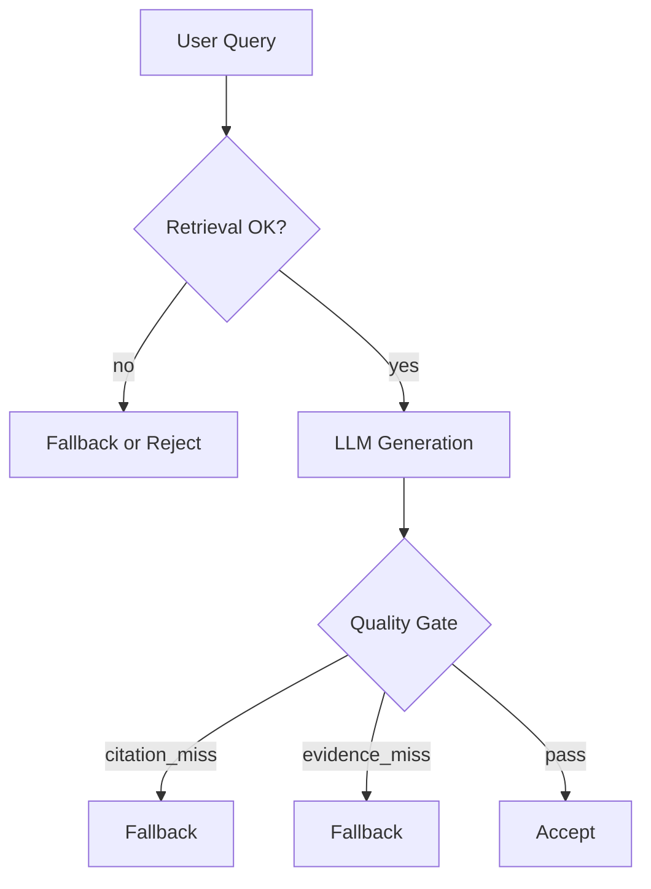

# RAG Knowledge Base System

A production-minded Retrieval-Augmented Generation (RAG) backend engineered for **high reliability, grounded answers, and deterministic behavior**.

> This project focuses on *preventing hallucinations* and *making LLM failures explicit*, rather than maximizing raw answer recall.

---

## Why This RAG Is Different

Most RAG demos stop at “it works on my PDF.”  
This system is designed around **correctness guarantees**:

* **Post-generation Quality Gate** — answers are verified *after* LLM generation
* **Deterministic regression testing** for stochastic LLM behavior
* **Explicit failure modes** (`accept` / `fallback` / `reject`), never silent hallucination

---
## System Guarantees & Non-Goals

### Guarantees

This system provides the following **verifiable guarantees**:

* **Groundedness Guarantee**  
  All answers are derived *strictly* from retrieved evidence. Ungrounded answers trigger an automatic fallback or rejection via the Quality Gate.

* **Citation Integrity Guarantee**  
  Every factual claim must reference a valid citation `[S#]`. Missing, unused, or fabricated citations are detected.

* **Failure Transparency Guarantee**  
  The system never hallucinates silently. All failures are surfaced explicitly as:
  * `accept`: Answer is grounded and evidence-backed
  * `fallback`: Safe, citation-only summary when evidence is insufficient
  * `reject`: Retrieval or system-level failure

* **Regression Stability Guarantee**  
  All critical behaviors are covered by a regression suite (`scripts/gate_regression.sh`).  
  LLM responses are mocked to ensure deterministic testing without API quota dependency.

---

### Non-Goals

To preserve reliability, this system intentionally **does not** aim to be:

* ❌ A general-purpose chatbot
* ❌ Optimized for creative or speculative writing
* ❌ A black-box LLM wrapper (all internals are observable)

---

### Contract: Answer Generation Flow



**Logical Contract:**
1.  **IF** `retrieval.ok` is True **AND** `citation.ok` is True **AND** `evidence_hit` is True:
    *   **THEN** Decision is `accept`. The answer is returned to the user.
2.  **ELSE IF** `retrieval.ok` is True **BUT** (`citation.ok` is False **OR** `evidence_hit` is False):
    *   **THEN** Decision is `fallback`. A transparent, citations-only summary is returned.
3.  **ELSE**:
    *   **THEN** Decision is `reject`. A specific error reason is returned.

## Quick Start

### Prerequisites
*   Python 3.11+
*   Docker (optional)

### Running Locally
```bash
# Start backend
./scripts/ci_start.sh

# Run Regression Tests
./scripts/gate_regression.sh
```

