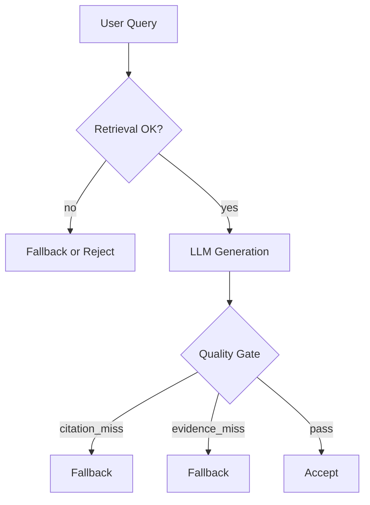

# RAG Knowledge Base System

A strictly engineered Retrieval-Augmented Generation (RAG) system designed for high-reliability knowledge retrieval.

## System Guarantees & Non-Goals

### Guarantees
This system is engineered to provide the following verifiable guarantees:

*   **Groundedness Guarantee**: All answers are derived *strictly* from retrieved evidence. Ungrounded answers trigger an automatic fallback or rejection via the Quality Gate.
*   **Citation Integrity Guarantee**: Every factual claim in an answer must reference a valid source citation `[S#]`. Missing or unused citations are detected and flagged.
*   **Failure Transparency Guarantee**: The system never hallucinates silently. Failures are explicitly surfaced as:
    *   `reject`: System-level error or complete retrieval failure.
    *   `fallback`: Safe, grounded summary when evidence is insufficient.
    *   Explicit "I don't know based on the provided document" response.
*   **Regression Stability Guarantee**: All critical behaviors (Quality Gate decisions, Fallback logic) are covered by a regression suite (`scripts/gate_regression.sh`). LLM behavior is mocked to ensure deterministic testing.

### Non-Goals
To maintain specialized reliability, this system explicitly **does not** aim to be:
*   ❌ A general knowledge chatbot (it will not answer questions outside its Knowledge Base).
*   ❌ Optimized for creative or speculative writing.
*   ❌ A "black box" AI wrapper (internals are observable via structured metrics).

## System Contracts

The system enforces the following contracts during the Answer Generation phase.

### Contract: Answer Generation Flow



**Logical Contract:**
1.  **IF** `retrieval.ok` is True **AND** `citation.ok` is True **AND** `evidence_hit` is True:
    *   **THEN** Decision is `accept`. The answer is returned to the user.
2.  **ELSE IF** `retrieval.ok` is True **BUT** (`citation.ok` is False **OR** `evidence_hit` is False):
    *   **THEN** Decision is `fallback`. A transparent, citations-only summary is returned.
3.  **ELSE**:
    *   **THEN** Decision is `reject`. A specific error reason is returned.

## Quick Start

### Prerequisites
*   Python 3.11+
*   Docker (optional)

### Running Locally
```bash
# Start backend
./scripts/ci_start.sh

# Run Regression Tests
./scripts/gate_regression.sh
```

